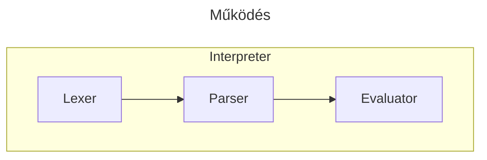
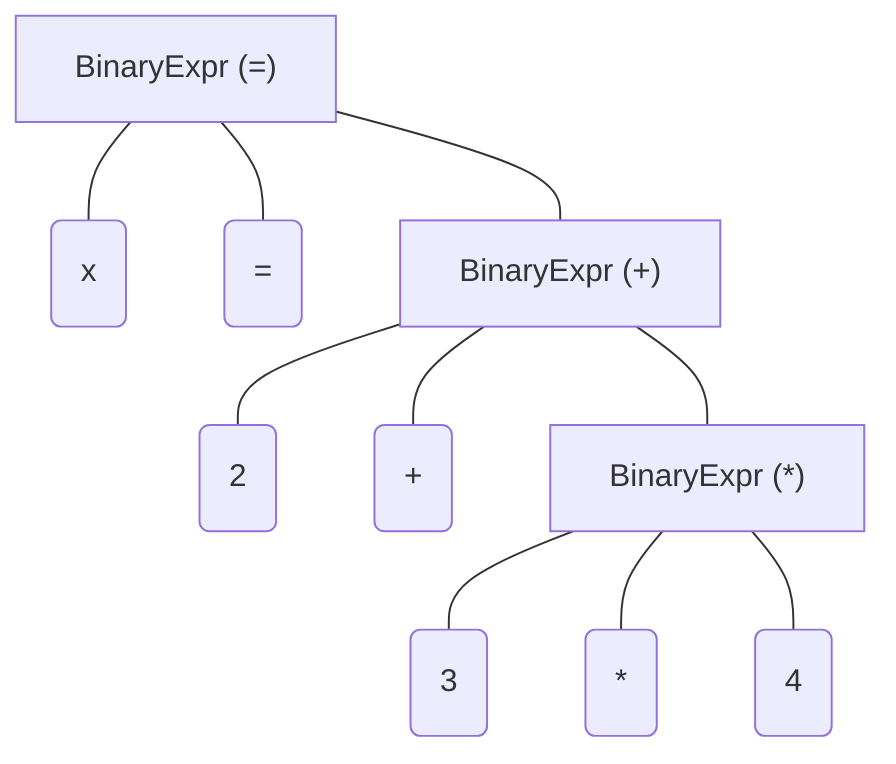

# Számológép

A projekt egy számológép, mely képes különböző matematikai képleteket megvalósítani.

## Funkciók

- Alap matematikai bináris műveletek: összeadás (+), kivonás (-), szorzás (\*), osztás (/), hatványozás (^)
- Unáris műveletek: identity (+), negálás (-), faktoriális (pl. `4!`), fok radiánná alakítása (pl. `90°`)
- Műveleti sorrend
- Zárójelezés
- Változók pl.
  - `x = 2 + 3`
  - `y = x + 3`
- Szövegek (`"pl ez"`) és logikai érték
- Konverzió double-ből többi típusra: `i8`, `i16`, `i32`, `i64`, `f32`, `f64` függvényekkel
- Logikai függvények: `and`, `or`, `not`
- Konstansok
  - `pi`, `e`, `null`, `true`, `false`
- Függvények importálása C# és .NET-ből
  - `import * __decapitalize__ from System.Math` behúzza az összes függvényt a Math library-ből és kicseréli a kezdőbetűit kicsire (szóval a `Sin`-ből `sin` lesz)
  - módosítók:
    - \_\_decapitalize\_\_: kisbetűss kezdés
    - \_\_capitalize\_\_: nagybetűs kezdés
    - \_\_lower\_\_: kisbetűs végig
    - \_\_upper\_\_: nagybetűs végig
    - \_\_classname\_\_: a függvény az osztály nevével lesz elérhető, pl. `Math.Sin`
    - \_\_methodname\_\_: a függvény a nevével lesz elérhető, pl. `Sin`
    - \_\_fullname\_\_: a függvény az osztály teljes nevével lesz elérhető, pl. `System.Math.Sin`
  - A módosítók kombinálhatóak, alapból mindhárom névvel beregisztrálja (felül is írhat már létezőt), illetve a neves módosítók bármilyen kombinációban használhatóak

## Működés

### Interpreter

A program egyben tartója az Interpreter. Ő azért felel, hogy a különböző modulokat összetartsa, és bemenetül kapott stringből visszaadjon egy értelmezett és kiszámolt értéket. Három fázisból áll: `Lexer`, `Parser` és `Evaluator`

### Lexer

A Lexer felel azért, hogy a beérkező stringből tokeneket gyártson, hogy azokat a későbbi fázisokban könnyebb legyen kezelni.

Pl. a
`x = 2 + 3 * 4` kifejezésből a következő listát generálja

- IdentifierToken("x")
- AssignmentToken
- NumberLiteralToken(2)
- AddToken
- NumberLiteralToken(3)
- MultiplyToken
- NumberLiteralToken(4)
- EndToken

A whitespace-ket általában kiszűri és ignorálja, de megkérhetjük, hogy azokat is tartsa meg

### Parser

A Parser felel azért, hogy a listányi tokeneket Abstract Syntax Tree-be rendezze

A fenti kifejezésből ezt generálja:

### Evaluator

Az Evaluator dolga bejárni a fát, beazonosítani az elvégzendő művelet típusát, és azt végrehajtani. Ezeket SubEvaluator-okkal végzi, amelyeket Reflection-nel csatol a fában található node-okhoz.

Szóval a fenti fában először az assignment-hez tartozó Bináris kifejezést kezdi el kiértékelni. Ez beidézi az `AssignmentOperator`-t, amely a baloldalon található identifiert, az x-hez a jobboldalon található kifejezést csatolja.

A jobboldali kifejezés kiértékelésével a Bináris kifejezés betölti az `AddOperator`-t, amelynek a bal oldalán egy 2-es található, a jobb oldalán egy kifejezés.

Ennek a Bináris kifejezésnek a kiértékelése betölti a `MultiplyOperator`-t, amely kiértékeli a 3 \* 4 kifejezést.

Ez visszaadja az 12-t az összeadás operátornak, amely kiértékeli a 2 + 12 kifejezést.

Ez visszaadja az értékadás operátornak, amely eltárolja a 14-t az x változóba.

### Bugok

A fát jobb oldal fele bontja, amelynek következtében pl. a 2 / 3 \* 4 kifejezés 2 / (3 \* 4) zárojelezéssel lesz értékelve.
